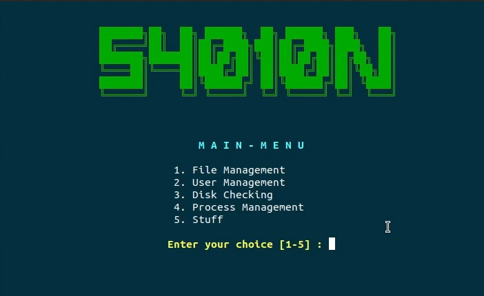

# 54010n Tool - A basic shell script tool
The basic bash script tool is made by 54010N Team!

## Demo
Quick demo tool [here](https://youtu.be/Aekr2aW-kps)

## Functions
- File Management
  - Create/Delete file
  - Set permission
  - Move/Copy file
- User Management
  - Create new user
  - Lock user
  - Backup user folder
  - Show all user
- Disk Checking & Email Alert
  - Backup any folder
  - Auto alert to email
- Processes Management
  - Show all process
  - Show detail process by PID
  - Terminate a process
  - Show RAM info
- Stuff
  - whois tool interface
  - Calculator
  - Archive backup file and Email

## Note
Copyrights by 54010N Team!
